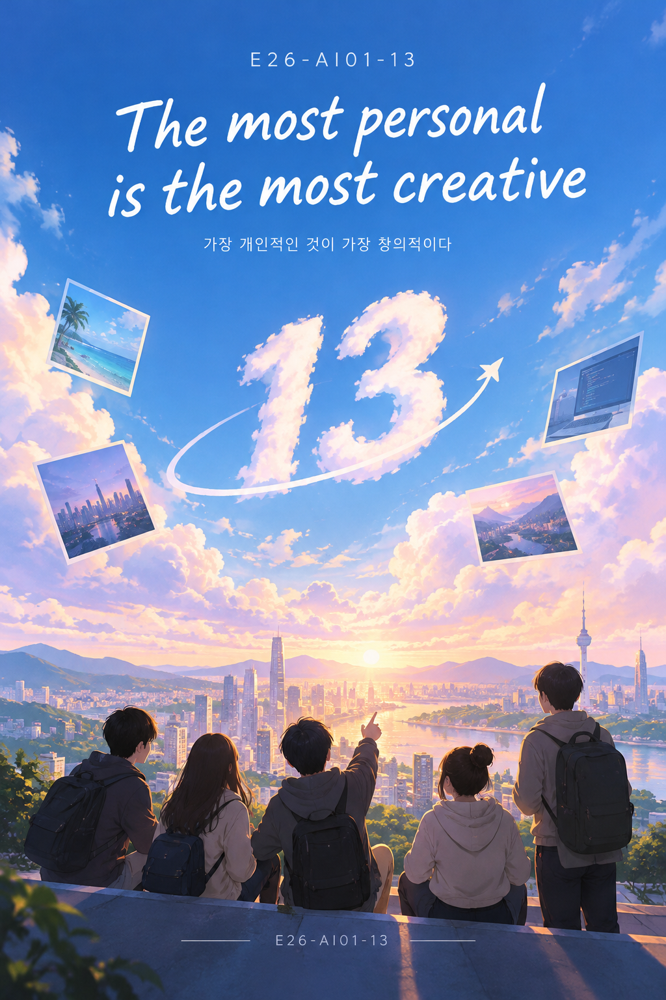

# Welcome to E26-AI01-13

## 🎯 팀 슬로건

> **The most personal is the most creative**

---

## 🖼️ 팀 포스터

---

## 1️⃣ 👥 팀원소개

| 이름 | 전공 | 관심사 |
|:---:|:---:|:---|
| 김원준 | 인공지능전공 | 해외인턴, 인공지능, 프론트엔드 |
| 옥진수 | 인공지능학부 | 보안, 프론트엔드, 백엔드, 인공지능 |
| 표프윈퓨 | 인공지능학부 | 알고리즘, 시스템 프로그래밍, 스타트업 |
| 편서연 | 인공지능학 | UX/UI, 모바일 앱, 창업 |

---

## 2️⃣ 💡 공통된 관심사

> **음식 · 영화 · 인공지능**

---

## 3️⃣ 🚀 한학기 동안의 활동 내역

### 🟦 26/10/02 — 미래 서비스 콘셉트 시각화

- 🏢 기관/부서 인터뷰
- 🗺️ 현장 탐방
- 👨‍🏫 멘토링
  - 내 지도 교수 함께 만나기
  - 대학원 방문 및 선배 만나기
- 💻 프로젝트 진행
  - 과거에 사람들이 상상한 미래
  - 그들이 만들어가는 세상
  - 우리가 상상한 미래
  - 우리가 그리는 미래 그리고 나
- 💬 각오와 소감 나누기

---

## 4️⃣ 💭 인상 깊은 활동

- 활동명 – 활동에 대한 간단한 설명과 배운 점을 작성
- 예: 멘토링에서 실리콘밸리 현업 경험을 들을 수 있어 진로 방향 설정에 큰 도움이 되었다.

---

## 5️⃣ 🔍 특별히 알아보고 싶은 것

- 예: 현장실습 제도
- 예: 학부 졸업 인증 조건
- 예: 성취기반평가
- 예: 졸업 후 진로(대학원/취업)

---

## 6️⃣ 📝 활동을 마친 소감

🔗학번 이름

> "소감 내용을 여기에 작성합니다."

🔗학번 이름

> "소감 내용을 여기에 작성합니다."

🔗학번 이름

> "소감 내용을 여기에 작성합니다."

🔗학번 이름

> "소감 내용을 여기에 작성합니다."

🔗학번 이름

> "소감 내용을 여기에 작성합니다."

---

### 🟦 E26-AI01-13

**The most personal is the most creative**

