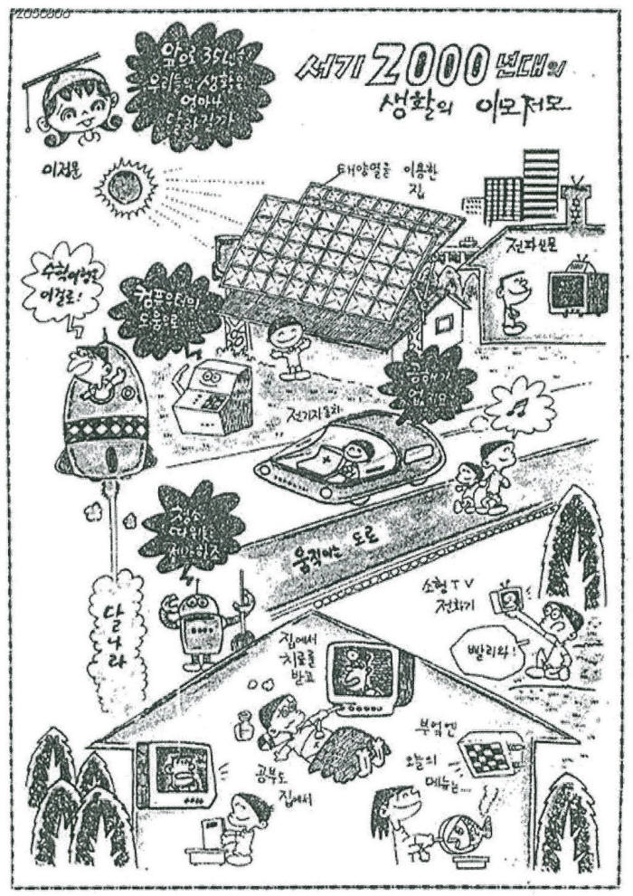

# Welcome to E26-AI01-13

## 🎯 팀 슬로건

The most personal is the most creative

## 🖼️ 팀 포스터

<div class="poster"></div>

<p align="center" class="poster-caption"><sub>이정문 화백, 「서기 2000년대 생활의 이모저모」(1965). 출처: <a href="https://v.daum.net/v/d4FeeJV0EN">전자신문 [과학 핫이슈] 1965년에 상상한 2000년대, 지금 그려보는 20년 후</a></sub></p>

1965년에 35년 뒤의 생활을 상상해 그린 이 그림처럼, 우리 팀이 그리는 미래를 포스터로 만들어 봅시다.
팀 활동으로 만든 포스터를 `poster.jpg` 파일 이름으로 이 repository에 업로드하면 위 그림이 팀 포스터로 바뀝니다.
파일 이름이 다르거나 png 파일이면 위 ``의 파일 이름을 맞추고, 출처 문구도 팀에 맞게 고쳐 주세요.

> **포스터 파일 권장 규격**: A4 세로 비율(1 : 1.414), 1240×1754px 이상, JPG, 2MB 이하.
> 홈페이지에서는 어떤 크기·비율의 파일을 올려도 같은 크기의 세로 틀 안에 맞춰 표시되지만, 권장 규격을 지키면 여백 없이 가장 선명하게 보입니다.

***

## 1️⃣ 팀원 소개

| **이름** | **전공** | **관심사** |
| --- | --- | --- |
| **홍길동** | 인공지능전공 | 해외인턴, 인공지능, 프론트엔드 |
| **김영희** | 인공지능전공 | 보안, 프론트엔드, 백엔드, 인공지능 |
| **이철수** | 인공지능전공 | 알고리즘, 시스템 프로그래밍, 스타트업 |
| **박민수** | 인공지능전공 | UX/UI, 모바일 앱, 창업 |
| **최지현** | 인공지능전공 | 분산 시스템, 데이터베이스, 오픈소스 |

유레카프로젝트 팀 생성을 축하합니다.
팀의 제목과 슬로건, 팀원의 이름 및 관심사를 변경하세요.

### 팀 소개

팀의 소개를 작성합니다.

***

## 2️⃣ 공통된 관심사 : 여행, 백엔드, 인공지능

***


## 3️⃣ 한학기 동안의 활동 내역 

26/10/2 미래 서비스 콘셉트 시각화 활동결과

STEP 01. 문제 정의 (핵심 1문장)

대학생은 메일, 공지사항, 단톡방으로 들어오는 학교 정보가 너무 많고 여러 곳에 흩어져 있어서, 장학금·특강·수업처럼 자신에게 필요한 정보를 제때 확인하지 못하고 놓친다.

구조적 정의
구분	내용
사용자	여러 과목을 수강하며 학교 공지, 과제, 장학금 정보를 챙겨야 하는 대학생 (특히 학교 시스템에 익숙하지 않은 1~2학년)
상황	학교 앱, 학과 홈페이지, e-캠퍼스, 메일, 단톡방에서 하루에도 수십 개의 알림이 오고, 그중 상당수는 나와 관계없는 내용임. 정작 필요한 정보(과제 마감, 장학금 신청, 휴강)는 각각 다른 곳에 올라옴
문제	불필요한 알림이 많아 알림 자체를 무시하게 되고, 필요한 정보를 찾으려면 여러 곳을 직접 확인해야 해서 마감과 신청 기간을 놓침
기대효과	확인 시간 감소, 정보 누락 감소, 알림 신뢰도 회복

정보가 부족한 것이 아니라, 나에게 필요한 정보만 골라서 한곳에서 받을 수 없는 것이 핵심 문제다.

STEP 02. AI와 소통한 주요 프롬프트
"대학생활하며 불편한 점(해결해야 할 점)을 알려줘"
"'문제상황의 핵심 문제와 사용자 요구사항을 추상화해서 다시 정의해줘'라는 요구에 맞는 주제를 추천하고, 추상화와 정의를 해줘"
"사용자, 상황, 문제, 기대효과가 명확히 포함된 구조적인 문제 정의를 해줘 (알림은 많이 오는데 불필요한 정보가 많아 확인이 어렵고, 꼭 필요한 정보는 흩어져 있음)"
"이 문제로 결과물을 정리해줘. 서비스 콘셉트는 메일과 채팅을 유형별로 필터링하고, 공지와 메일을 취합해 알려주는 학교생활 비서"
STEP 03. AI 제안 내용 요약
대학생활 불편함을 학사·수업, 팀플·학습, 캠퍼스 생활, 생활·경제, 진로 영역으로 나눠 제시
추상화 과제에 맞는 주제로 ① 학사 정보 분산 ② 캠퍼스 공간 이용 ③ 강의자료 복습을 추천
1번 문제를 "정보가 부족한 게 아니라 정보와 사람이 연결되지 않는 문제"로 추상화
사용자 요구사항을 통합, 필터링, 적시성, 요약 네 가지로 정리
기대효과로 확인 시간 감소, 정보 누락 감소, 알림 신뢰도 회복을 제시
STEP 04. 팀의 수정 및 검토 내용
주제 선택: AI가 제안한 주제 중 1번과 2번을 비교한 뒤, 팀원들이 직접 자주 겪는 1번을 선택
문제 구체화: AI의 정의는 '정보 분산' 중심이었지만, 팀은 실제 경험을 바탕으로 '불필요한 알림이 너무 많다'는 알림 과부하를 문제의 한 축으로 추가
해결 방향 결정: 유형별(장학금, 특강, 수업) 분류와 메일·공지 취합을 결합한 '학교생활 비서' 형태로 팀이 직접 결정
STEP 05. 선택한 방향 및 다음 질문
선택한 방향: (가칭) 학교생활 AI 비서
학교 메일, 공지사항, 단톡방 메시지를 한곳에 모음
장학금, 특강, 수업, 행사 등 유형별로 자동 분류
마감일이나 신청 기간이 있는 정보는 요약해서 미리 알림
다음 질문
 데이터를 어떻게 가져올까? 학교 메일과 홈페이지는 가능성이 있지만, 카카오톡 단톡방은 외부 서비스가 내용을 읽어올 공식적인 방법이 마땅치 않음
 분류 기준은 누가 정할까? 고정된 카테고리 vs 사용자가 직접 설정
 '중요한 정보'의 기준은 무엇일까? 마감일 유무, 내 학과·학년과의 관련성 등
 AI가 잘못 분류해서 중요한 공지를 놓치면 어떻게 보완할까?
 개인 메일과 채팅을 다루는 만큼 개인정보 동의는 어떻게 받을까?
팀별 1분 공유 스크립트

저희 팀은 "학교 정보가 너무 많고 흩어져 있어서 필요한 정보를 놓친다"는 문제를 정의했습니다. AI는 대학생활의 불편함을 넓게 정리하고, 이것을 '정보와 사람이 연결되지 않는 문제'로 추상화하는 데 도움을 줬습니다.

사람이 결정한 부분은 세 가지입니다. 첫째, 여러 후보 중 저희가 실제로 겪는 문제를 골랐습니다. 둘째, '알림이 너무 많다'는 경험을 문제 정의에 추가했습니다. 셋째, 메일과 공지를 유형별로 분류해 알려주는 학교생활 비서를 해결 방향으로 정했습니다.

다음 단계로는 단톡방 같은 데이터를 실제로 가져올 수 있는지부터 확인할 계획입니다.


- 기관/부서 인터뷰 ✔️  

- 현장 탐방 ✔️  

- 멘토링 ✔️  
  - 내 지도 교수 함게 만나기
  - 대학원 방문 및 선배 만나기

- 프로젝트 진행 ✔️  
  - 과거에 사람들이 상상한 미래
  - 그들이 만들어가는 세상
  - 우리가 상상한 미래
  - 우리가 그리는 미래 그리고 나

- 각오와 소감 나누기 ✔️  


<!-- 활동 사진 추가 예시 -->


***

## 4️⃣ 인상 깊은 활동

- 활동명 – 활동에 대한 간단한 설명과 배운 점을 작성  
- 예: 멘토링에서 실리콘밸리 현업 경험을 들을 수 있어 진로 방향 설정에 큰 도움이 되었다.  

***

## 5️⃣ 특별히 알아보고 싶은 것
- 예: 현장실습 제도
- 예: 학부 졸업 인증 조건
- 예: 성취기반평가
- 예: 졸업 후 진로(대학원/취업)

***

## 6️⃣ 활동을 마친 소감

🔗학번 이름  
> "소감 내용을 여기에 작성합니다."

🔗학번 이름  
> "소감 내용을 여기에 작성합니다."

🔗학번 이름  
> "소감 내용을 여기에 작성합니다."

🔗학번 이름  
> "소감 내용을 여기에 작성합니다."

🔗학번 이름  
> "소감 내용을 여기에 작성합니다."


## Markdown을 사용하여 내용꾸미기를 익히세요.

Markdown은 작문을 스타일링하기위한 가볍고 사용하기 쉬운 구문입니다. 여기에는 다음을위한 규칙이 포함됩니다.

```markdown
Syntax highlighted code block

# Header 1
## Header 2
### Header 3

- Bulleted
- List

1. Numbered
2. List

**Bold** and _Italic_ and `Code` text

[Link](url) and 
```

자세한 내용은 [GitHub Flavored Markdown](https://guides.github.com/features/mastering-markdown/).

### Support or Contact

readme 파일 생성에 추가적인 도움이 필요하면 [도움말](https://help.github.com/articles/about-readmes/) 이나 [contact support](https://github.com/contact) 을 이용하세요.

